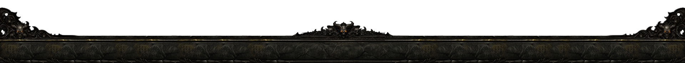

<p align="center">
  
</p>

<h1 align="center">POE Unofficial Launcher</h1>

<p align="center">
  
  
  
</p>

<p align="center">
  <a href="README.md"><b>EN</b></a> | <a href="docs/README_KR.md"><b>KR</b></a>
</p>

> **Disclaimer**: This is an **unofficial** launcher for **Path of Exile** & **Path of Exile 2**. It is not affiliated with Grinding Gear Games or Kakao Games. Use at your own risk.

An Electron-based custom launcher designed to automate the launch process for **Path of Exile** and **Path of Exile 2** (Korean Server). It provides a streamlined experience by handling login, Designated PC checks, and intro modals automatically across both game gateways.

<p align="center">
  
</p>

## Key Features

- **Automated Game Launch**: Automatically handles the entire launch sequence.
- **Popup Automation**: Checks and confirms "Designated PC" (지정 PC), "Login Required", and "Intro" modals without user intervention.
- **Dual Window Architecture**:
  - **Main Window**: Clean UI for launcher status and control.
  - **Background Game Window**: Handles the actual Daum Game Starter web process invisibly (or visibly in debug mode).
- **Secure Handling**: Does not store password data; relies on session cookies and existing browser login states where possible.

## Installation

1. Go to the [Releases](https://github.com/NERDHEAD-lab/POE2-unofficial-launcher/releases) page.
2. Download the latest `Setup.exe`.
3. Run the installer.

## Development

### Prerequisites

- Node.js (v18 or higher)
- npm or yarn

### Setup

```bash
# Clone the repository
git clone https://github.com/NERDHEAD-lab/POE2-unofficial-launcher.git

# Install dependencies & Setup environment
npm run setup
```

### Running Locally

```bash
# Run in development mode
npm run dev

# Run in debug mode (Show Game Window & DevTools)
npm run dev:test
```

### Building

```bash
# Build for production (Windows)
npm run build
```

## Contributing

Contributions are welcome! Please feel free to submit a Pull Request.

## License

This project is licensed under the [GNU Affero General Public License v3.0](LICENSE).

## Repository

[https://github.com/NERDHEAD-lab/POE2-unofficial-launcher](https://github.com/NERDHEAD-lab/POE2-unofficial-launcher)

<p align="center">
  
</p>
