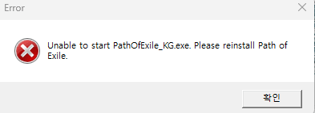
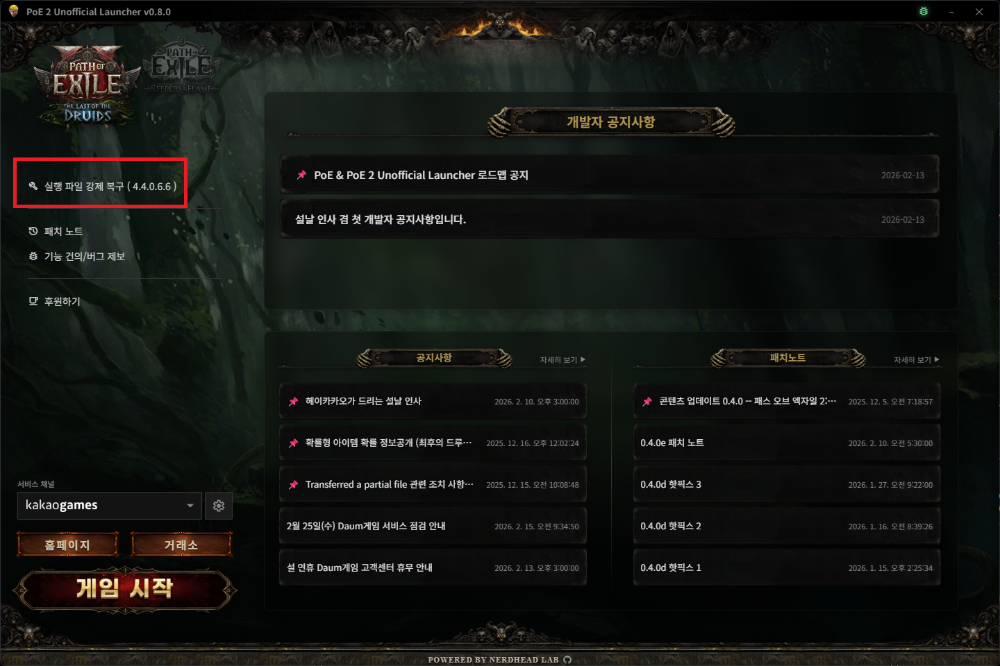

# Unable to start PathOfExile_KG.exe 조치 가이드 (임시)

안녕하세요. 개발자 NERDHEAD 입니다.
금일 오후 부터 발생하는 것으로 추정되는 아래 이슈에 대한 수동 가이드를 공유드립니다.

위와 같은 팝업이 뜨면서 게임 실행이 안되는 현상이 발생하고 있습니다.

아래 위치 참고하여 강제 패치 하면, 오류가 발생하고 있는 실행 파일을 덮어 씌우면서 정상적으로 게임 실행이 가능합니다.

아마 GGG 서버쪽에서 패치파일을 다운로드 받다가 중간에 끊기면서 파일이 손상된 것으로 추정됩니다.

추후 해당 이슈에 대한 로그파일이 확보되는대로, 자동화하여 릴리즈 진행하도록 하겠습니다.

이번 릴리즈가 0.9.0로 진행됨에 따라,
기존 0.9.0 로드맵은 0.10.0으로 이동 될 예정입니다.

## 2026-02-26 추가 수정 사항

신규 설치의 경우 게임 버전에 대한 로그조차 확인 할 수 없어 0.9.4 버전에서 추가적인 대응을 진행했습니다.
패치 파일의 버전을 확인 할 수 없을 경우 아래 url에서 최신 버전을 확인 하고 있습니다.
`https://nerdhead-lab.github.io/POE2-unofficial-launcher/latest-versions.json`

추후 github 연동 기능을 추가하여,
gh-pages에 등록된 latest-versions.json의 버전보다 상위의 버전을 가진 사용자가 있다면 자동으로 버전 정보를 업데이트 요청 하도록 개선 될 예정입니다.

해당 기능은 추후 게임 자동 업데이트 등의 기능에도 활용 될 수 있을 것으로 보입니다.

> github 접근성 문제로 인해 디스코드 연동 기능으로 대체 될 수 있습니다.

감사합니다.
